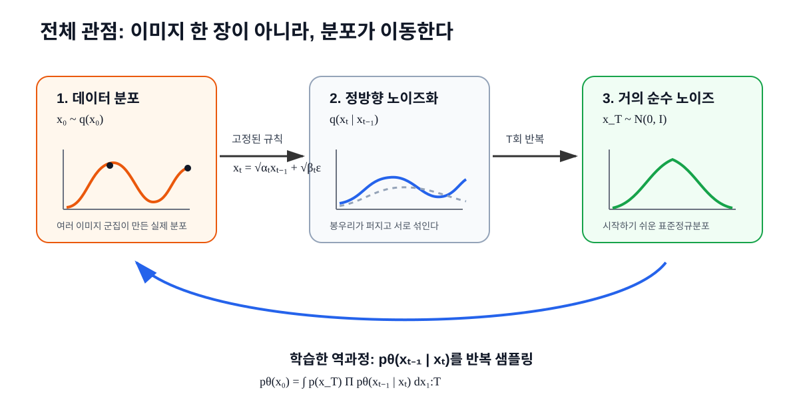
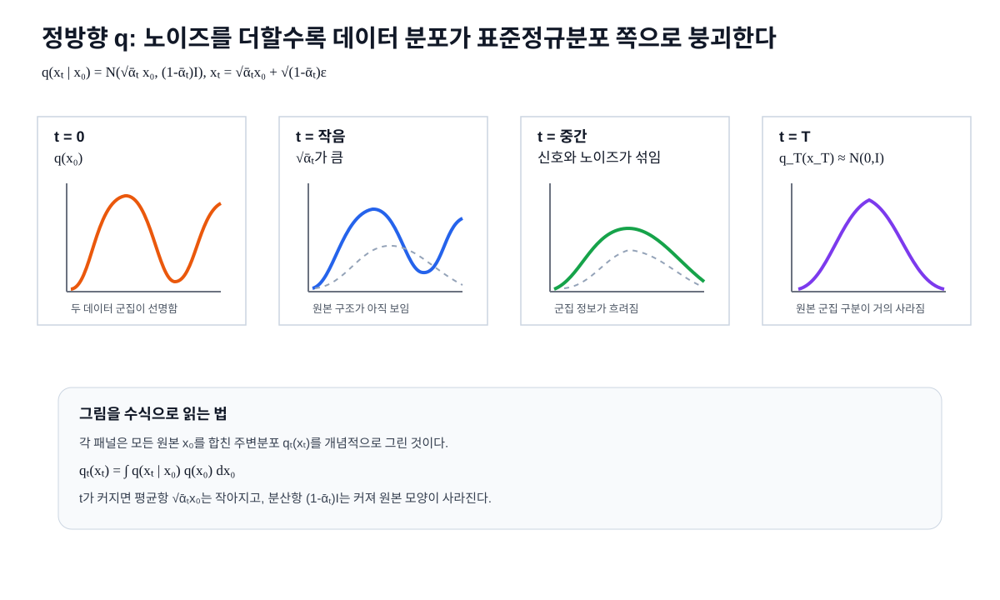
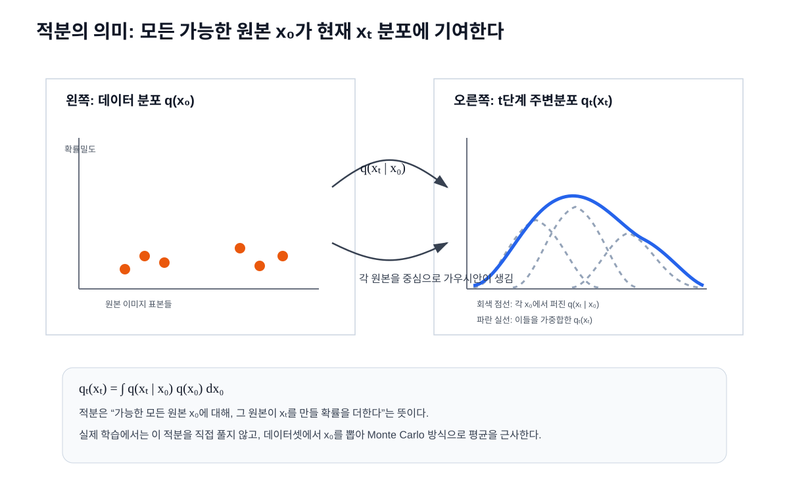
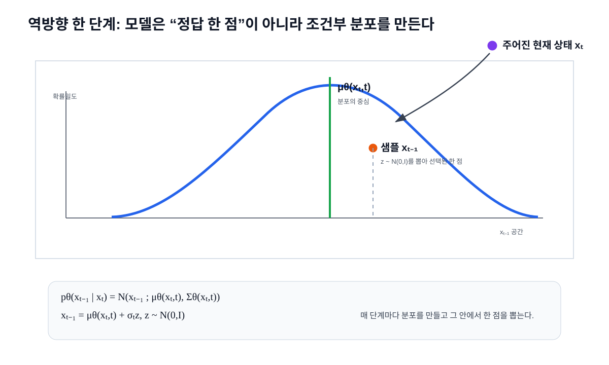
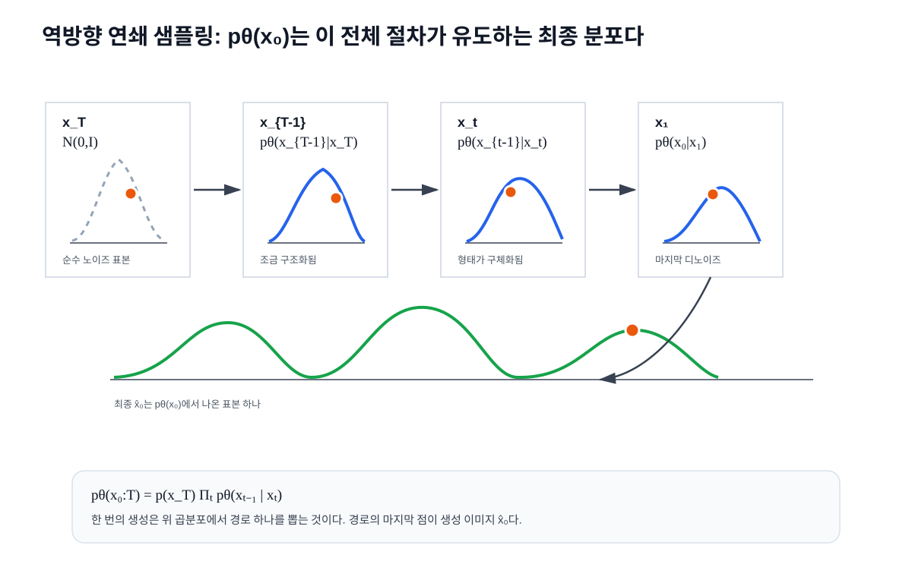
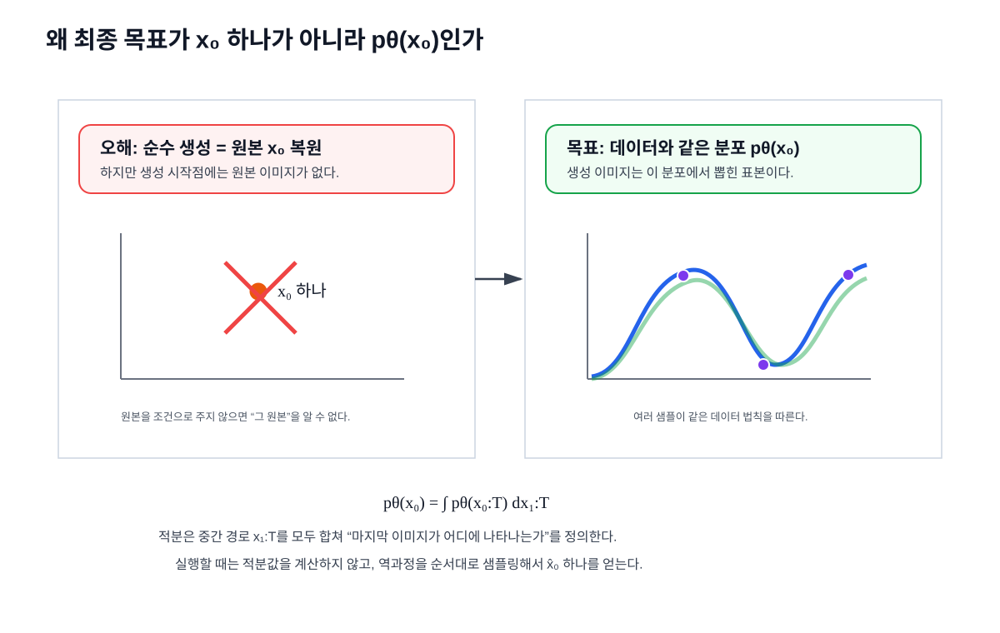

# 확산 모델 시각화 중심 해설: 노이즈화부터 디노이즈 샘플링까지

> 범위: 첨부된 DDPM 역과정 식을 기준으로 다시 작성했다. 공유된 ChatGPT 링크는 내용을 직접 읽어오지 못했기 때문에, 이 문서는 첨부 이미지의 수식 `pθ(x₀:T)`, `pθ(xₜ₋₁|xₜ)`, `pθ(x₀)`를 중심으로 설명한다.

## 0. 전체 그림

핵심은 “이미지 한 장이 복원된다”가 아니라 “분포가 이동한다”이다.

정방향은 실제 데이터 분포 `q(x₀)`를 점점 노이즈 분포 `N(0,I)`로 보낸다. 역방향은 반대로 `x_T ~ N(0,I)`에서 시작해 학습된 `pθ(xₜ₋₁|xₜ)`를 반복 샘플링한다. 마지막에 나온 한 장의 이미지는 `x̂₀ ~ pθ(x₀)`인 표본이다.

## 1. 정방향: 분포가 어떻게 노이즈가 되는가

한 이미지 `x₀`에 대해 정방향 노이즈화는 다음과 같다.

$$
x_t=\sqrt{\bar\alpha_t}x_0+\sqrt{1-\bar\alpha_t}\epsilon,
\qquad \epsilon\sim\mathcal N(0,I)
$$

그림의 왼쪽 `t=0`에서는 데이터 분포의 봉우리가 선명하다. 이는 데이터셋에 여러 이미지 군집이 있다는 뜻이다. `t`가 커질수록 `√ᾱ_t x₀`는 작아지고 `√(1-ᾱ_t)ε`는 커진다. 그래서 원본 정보는 약해지고, 분포는 점점 넓고 둥근 가우시안 형태로 변한다.

중요한 구분은 다음이다.

- `x_t`: 특정 원본 이미지 하나가 노이즈화된 표본.
- `q_t(x_t)`: 모든 원본 이미지가 노이즈화된 뒤 만들어지는 전체 분포.

즉, 한 장의 이미지에서는 점 하나가 움직이고, 데이터 전체에서는 분포의 모양이 변한다.

## 2. 적분은 어디서 일어나는가

원본 `x₀`를 알고 있으면 `q(x_t|x₀)`는 하나의 가우시안이다. 그러나 원본을 모른 채 “t단계 노이즈 이미지들이 어디에 많이 존재하는가”를 묻는다면 모든 원본을 합쳐야 한다.

$$
q_t(x_t)=\int q(x_t\mid x_0)q(x_0)\,dx_0
$$

그림에서 왼쪽의 각 점은 원본 이미지 표본이다. 각 원본은 오른쪽에서 회색 점선 가우시안 하나로 퍼진다. 적분은 이 회색 가우시안들을 원본 분포 `q(x₀)`의 비중만큼 더해서 파란색 전체 분포 `q_t(x_t)`를 만드는 연산이다.

따라서 적분하면 확률분포는 다음처럼 변한다.

- 적분 전: 특정 원본이 주어진 조건부 분포 `q(x_t|x₀)`.
- 적분 후: 원본을 모르는 전체 주변분포 `q_t(x_t)`.

실제 학습에서는 이 적분을 직접 계산하지 않는다. 데이터셋에서 `x₀`를 뽑고, `t`를 뽑고, `ε`를 뽑아서 표본 평균으로 근사한다.

## 3. 역방향 한 단계: 디노이즈는 점 이동이 아니라 조건부 분포 샘플링이다

첨부 이미지의 핵심 역전이는 다음이다.

$$
p_\theta(x_{t-1}\mid x_t)=
\mathcal N(x_{t-1};\mu_\theta(x_t,t),\Sigma_\theta(x_t,t))
$$

현재 상태 `x_t`가 주어지면 모델은 이전 상태 `x_{t-1}`이 있을 법한 분포를 만든다. 이 분포의 중심은 `μθ(x_t,t)`이고, 퍼짐은 `Σθ(x_t,t)`이다.

실제 샘플링은 다음처럼 이루어진다.

$$
x_{t-1}=\mu_\theta(x_t,t)+\sigma_tz,
\qquad z\sim\mathcal N(0,I)
$$

여기서 `z`를 뽑는 순간이 “분포에서 샘플링하는 부분”이다. DDIM처럼 결정론적인 샘플러를 쓰면 이 난수 항을 줄이거나 없앨 수 있지만, DDPM의 기본 그림에서는 매 단계가 조건부 가우시안에서 샘플을 뽑는 절차다.

## 4. 역방향 전체: 첨부 식을 그래프로 읽기

첨부 이미지의 joint distribution은 이 그림 전체를 수식으로 쓴 것이다.

$$
p_\theta(x_{0:T})
=p(x_T)\prod_{t=1}^{T}p_\theta(x_{t-1}\mid x_t)
$$

읽는 순서는 생성 절차 기준으로 다음이다.

1. `x_T ~ N(0,I)`를 먼저 뽑는다.
2. `pθ(x_{T-1}|x_T)`에서 `x_{T-1}`을 뽑는다.
3. 같은 방식으로 `x_{T-2}`, `x_{T-3}`, ..., `x_1`을 뽑는다.
4. 마지막으로 `pθ(x_0|x_1)`에서 `x̂₀`를 뽑는다.

이 한 번의 절차는 가능한 수많은 경로 중 하나를 선택한다. 그래서 생성 결과 한 장은 “가장 그럴듯한 원본을 복원한 것”이 아니라 “학습된 역과정이 만든 하나의 경로 끝점”이다.

## 5. 왜 최종적으로 구하는 것이 x₀가 아니라 pθ(x₀)인가

`x₀`와 `pθ(x₀)`는 대상이 다르다.

| 대상 | 의미 |
|---|---|
| `x₀` | 이미지 한 장, 즉 고차원 픽셀 공간의 점 하나 |
| `pθ(x₀)` | 이미지들이 어느 영역에 얼마나 자주 나타나는지를 나타내는 분포 |

생성 모델의 시작점에는 원본 `x₀`가 없다. 시작점은 `x_T ~ N(0,I)`이다. 따라서 모델이 풀어야 하는 문제는 “원본 한 장을 맞히기”가 아니라 “데이터셋과 같은 종류의 이미지가 나오도록 최종 분포를 맞히기”다.

첨부 이미지의 마지막 식은 다음이다.

$$
p_\theta(x_0)
:=\int p_\theta(x_{0:T})\,dx_{1:T}
$$

여기서 `x₁:T`는 최종 이미지가 만들어지는 중간 경로다. 적분은 가능한 모든 중간 경로를 합쳐서 “마지막 결과가 `x₀` 근처에 도착할 확률”을 정의한다. 하지만 실제 생성할 때 이 적분을 계산하지 않는다. `x_T`부터 시작해 조건부 분포를 순서대로 샘플링하면, 그 끝점이 자연스럽게 `pθ(x₀)`에서 나온 표본이 된다.

## 6. 수식과 그래프의 대응표

| 수식 | 그래프에서 보이는 것 | 의미 |
|---|---|---|
| `x_t=√ᾱ_t x₀+√(1-ᾱ_t)ε` | 정방향 분포가 점점 퍼지는 그림 | 원본 신호는 줄고 노이즈는 커진다 |
| `q_t(x_t)=∫q(x_t|x₀)q(x₀)dx₀` | 여러 회색 가우시안을 더해 파란 분포를 만드는 그림 | 모든 원본의 기여를 합친다 |
| `pθ(xₜ₋₁|xₜ)=N(μθ,Σθ)` | 현재 `x_t`에서 이전 상태의 가우시안 분포를 만드는 그림 | 모델이 한 단계 역분포를 예측한다 |
| `xₜ₋₁=μθ+σ_tz` | 가우시안 안에서 주황색 점 하나를 뽑는 그림 | 실제 샘플링이 일어나는 부분 |
| `pθ(x₀:T)=p(x_T)Πpθ(xₜ₋₁|xₜ)` | `x_T → x_{T-1} → ... → x₀` 연쇄 그림 | 전체 생성 경로의 확률 |
| `pθ(x₀)=∫pθ(x₀:T)dx₁:T` | 중간 경로들을 합쳐 최종 분포를 만드는 그림 | 최종 이미지 분포를 정의 |

## 7. 한 문장으로 정리

확산 모델은 어려운 고차원 이미지 분포 `q(x₀)`를 직접 다루지 않고, 이를 쉬운 노이즈 분포로 보낸 뒤, 학습된 조건부 역분포 `pθ(xₜ₋₁|xₜ)`를 단계적으로 샘플링해서 최종 분포 `pθ(x₀)`의 표본을 만든다.

## 참고 문헌

- Ho, Jain, Abbeel, *Denoising Diffusion Probabilistic Models* (2020), [arXiv:2006.11239](https://arxiv.org/abs/2006.11239).
- Sohl-Dickstein et al., *Deep Unsupervised Learning using Nonequilibrium Thermodynamics* (2015), [PMLR 37](https://proceedings.mlr.press/v37/sohl-dickstein15.html).
