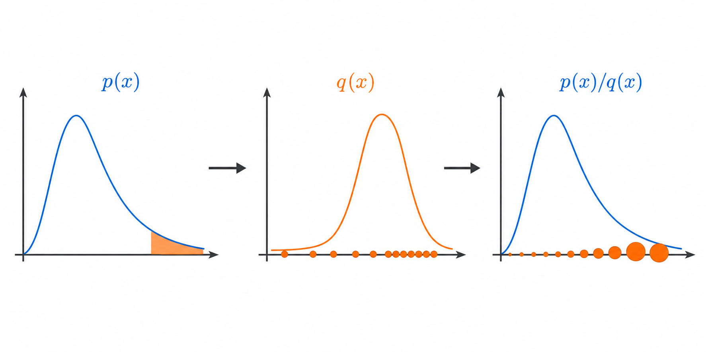
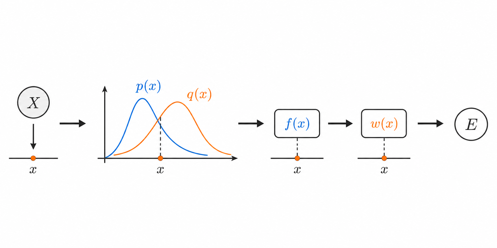
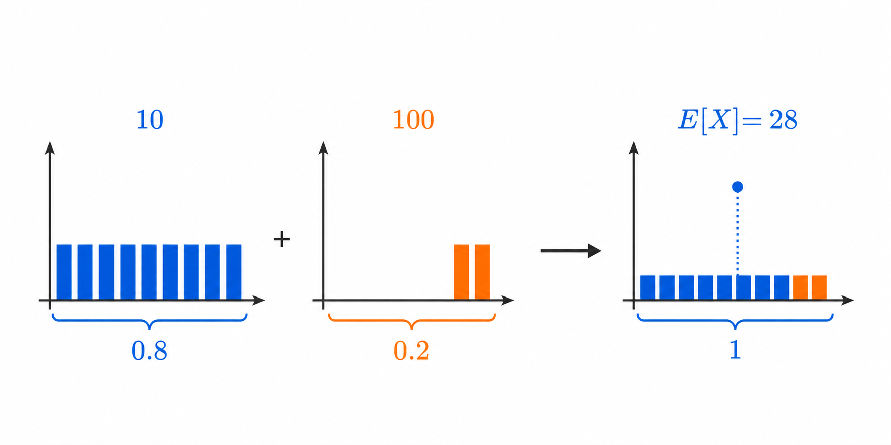
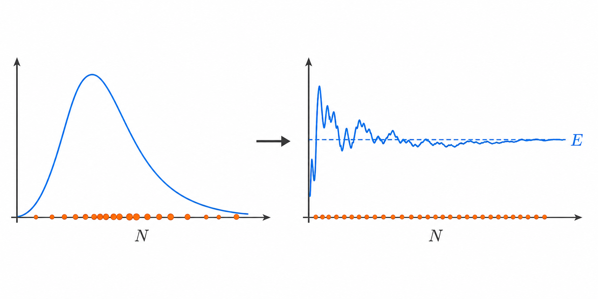
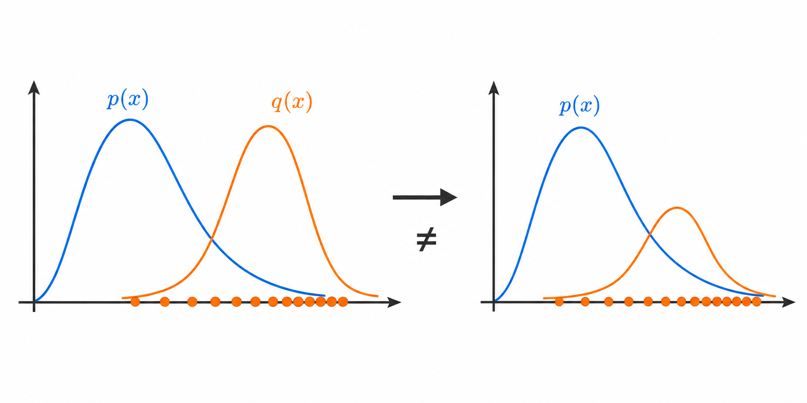
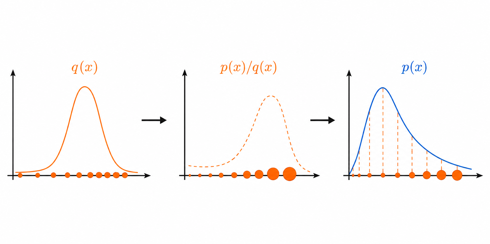
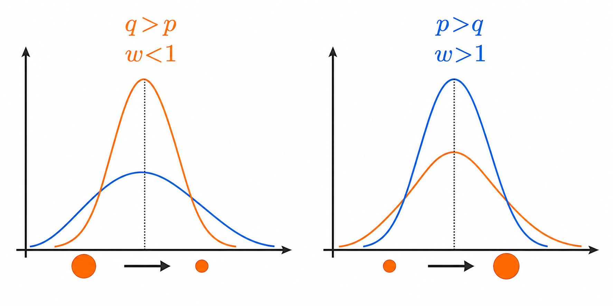
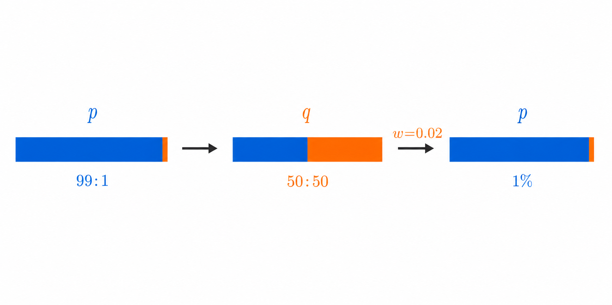
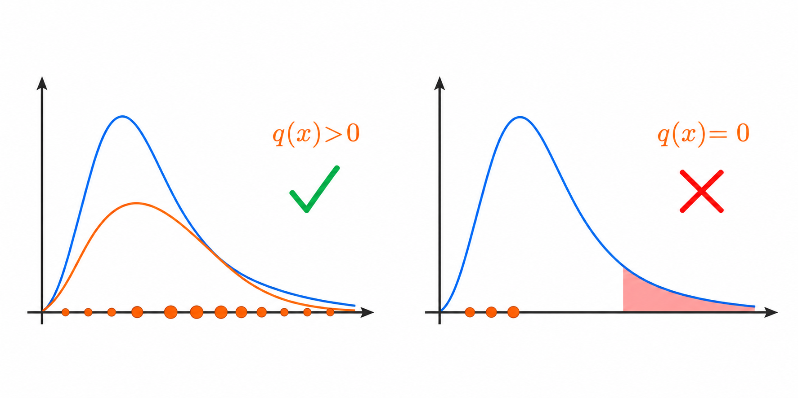
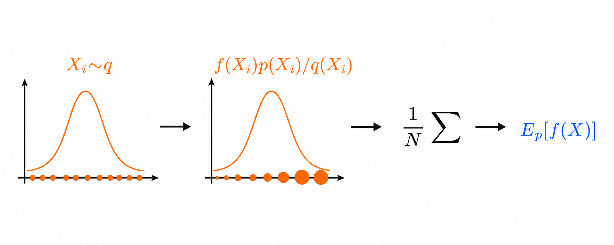

# Importance Sampling

Importance sampling은 목표 분포에서 직접 표본을 뽑기 어렵거나 비효율적일 때, 다른 분포에서 표본을 뽑은 뒤 가중치를 적용하여 목표 분포에서의 기댓값을 추정하는 방법입니다.

## 1. 키워드 정리

|기호|의미|
|---|---|
|$X$|확률적으로 값이 정해지는 확률변수|
|$x$|$X$가 가질 수 있는 구체적인 값|
|$p(x)$|기댓값을 계산하려는 목표 분포|
|$q(x)$|실제로 표본을 뽑는 제안 분포|
|$f(x)$|표본 $x$에서 계산하려는 값|
|$w(x)$|$p$와 $q$의 차이를 보정하는 가중치|
|$\mathbb{E}_p[f(X)]$|$X\sim p$일 때 $f(X)$의 평균|

이산확률변수에서 $p(x)$와 $q(x)$는 각 값의 확률을 의미합니다. 연속확률변수에서는 각 지점 주변에 확률이 얼마나 밀집되어 있는지를 나타내는 확률밀도입니다.

## 2. 기댓값

기댓값은 가능한 결과에 해당 결과가 나타날 가능성을 곱하여 모두 더한 확률 가중평균입니다.

예를 들어 10이 80%의 확률로, 100이 20%의 확률로 나온다면 기댓값은 단순 평균인 55가 아니라 28입니다.

이산확률변수에서는 가능한 값들을 하나씩 더합니다. 연속확률변수에서는 가능한 값들이 연속적으로 이어져 있으므로 합 대신 적분을 사용합니다.

### 수식 전개

$$ \begin{aligned} \mathbb{E}[X] &=10\times0.8+100\times0.2\\ &=28 \end{aligned} $$

이산확률변수:

$$ \mathbb{E}_{X\sim q}[f(X)] = \sum_x f(x)q(x) $$

연속확률변수:

$$ \mathbb{E}_{X\sim q}[f(X)] = \int f(x)q(x)\,dx $$

연속적인 경우 $q(x)$ 자체는 한 점의 확률이 아닙니다. $x$ 근처의 작은 구간에 들어갈 확률이 $q(x)\,dx$이므로, 그 구간이 기댓값에 기여하는 양은 $f(x)q(x)\,dx$입니다.

## 3. Monte Carlo 추정

복잡한 확률분포에서는 기댓값을 나타내는 적분을 정확히 계산하기 어려울 수 있습니다. 이때 목표 분포 $p$에서 표본을 여러 개 뽑고, 각 표본에 $f$를 적용한 결과의 평균으로 기댓값을 근사할 수 있습니다.

이 방법을 Monte Carlo 추정이라고 합니다. 표본 수가 충분히 많아지면 표본평균은 일반적으로 실제 기댓값에 가까워집니다.

### 수식 전개

$$ \mathbb{E}_{X\sim p}[f(X)] = \int f(x)p(x)\,dx $$

$$ X_1,X_2,\ldots,X_N\sim p $$

$$ \mathbb{E}_{p}[f(X)] \approx \frac{1}{N} \sum_{i=1}^{N}f(X_i) $$

하지만 목표 분포 $p$에서 직접 표본을 생성하기 어렵거나, 관심 있는 사건이 너무 드물다면 이 방법은 비효율적입니다.

예를 들어 고장 확률이 매우 작다면 대부분의 표본은 정상 사례가 됩니다. 고장과 관련된 표본을 충분히 얻으려면 막대한 수의 시뮬레이션이 필요합니다.

## 4. 제안 분포를 사용했을 때의 문제

이 문제를 해결하기 위해 표본을 더 효율적으로 생성할 수 있는 제안 분포 $q$를 사용합니다.

예를 들어 고장이 발생하는 조건을 더 자주 생성하도록 $q$를 설계할 수 있습니다. 그러면 고장 표본을 훨씬 많이 관찰할 수 있습니다.

그러나 $q$에서 뽑은 표본을 그대로 평균 내면 목표 분포 $p$가 아니라 제안 분포 $q$에서의 기댓값을 얻게 됩니다.

### 수식 전개

목표로 하는 값:

$$ \mathbb{E}_{p}[f(X)] = \int f(x)p(x)\,dx $$

$q$에서 뽑은 표본을 그대로 평균 낸 값:

$$ \mathbb{E}_{q}[f(X)] = \int f(x)q(x)\,dx $$

일반적으로

$$ \mathbb{E}_{p}[f(X)] \neq \mathbb{E}_{q}[f(X)] $$

입니다.

따라서 $q$를 사용하면서도 $p$에서의 기댓값을 얻으려면 두 분포의 차이를 보정해야 합니다.

## 5. Importance sampling의 수식

목표 기댓값 안에 $q(x)/q(x)=1$을 곱하면 식의 값은 변하지 않습니다. 이후 항의 순서를 바꾸면 전체 식을 $q$에서 계산한 기댓값 형태로 표현할 수 있습니다.

이때 $p(x)/q(x)$가 $q$와 $p$의 차이를 보정합니다. 이를 importance weight, 즉 중요도 가중치라고 합니다.

### 수식 전개

$$ \begin{aligned} \mathbb{E}_{p}[f(X)] &= \int f(x)p(x)\,dx\\ &= \int f(x)p(x)\frac{q(x)}{q(x)}\,dx\\ &= \int f(x)\frac{p(x)}{q(x)}q(x)\,dx\\ &= \mathbb{E}_{q} \left[ f(X)\frac{p(X)}{q(X)} \right] \end{aligned} $$

중요도 가중치를

$$ w(x)=\frac{p(x)}{q(x)} $$

라고 정의하면

$$ \mathbb{E}_{p}[f(X)] = \mathbb{E}_{q}[f(X)w(X)] $$

가 됩니다.

따라서 $q$에서 $N$개의 표본을 뽑아 다음과 같이 추정할 수 있습니다.

$$ \boxed{ \mathbb{E}_{p}[f(X)] \approx \frac{1}{N} \sum_{i=1}^{N} f(X_i)\frac{p(X_i)}{q(X_i)}, \qquad X_i\sim q } $$

## 6. 중요도 가중치의 의미

가중치 $p(x)/q(x)$는 특정 값 $x$가 제안 분포에서 목표 분포보다 얼마나 많이 또는 적게 나타나는지를 보정합니다.

제안 분포에서 너무 자주 뽑힌 표본은 영향력을 줄이고, 너무 적게 뽑힌 표본은 영향력을 키웁니다.

### 수식과 해석

$$ w(x)=\frac{p(x)}{q(x)} $$

$$ \begin{cases} w(x)>1 & \text{q가 x를 너무 적게 표본화함}\\ w(x)<1 & \text{q가 x를 너무 많이 표본화함}\\ w(x)=1 & \text{p와 q에서 나타나는 비율이 같음} \end{cases} $$

따라서 importance sampling의 핵심은 중요한 표본을 의도적으로 더 많이 얻되, 그렇게 증가한 빈도를 가중치로 다시 줄이는 것입니다.

## 7. 고장 확률 예제

실제 목표 분포에서는 정상 상태가 99%, 고장이 1%의 확률로 발생한다고 하겠습니다.

고장 여부를 나타내는 함수 $f$는 정상일 때 0, 고장일 때 1입니다. 따라서 $f(X)$의 기댓값은 고장 확률과 같습니다.

고장 표본을 더 많이 얻기 위해 제안 분포에서는 정상과 고장이 각각 50%의 확률로 나타나도록 설정합니다. 이 분포에서는 고장 사례를 자주 관찰할 수 있지만, 고장 표본을 원래보다 50배 많이 생성하므로 반드시 가중치로 보정해야 합니다.

### 수식 전개

목표 분포:

$$ p(\text{정상})=0.99, \qquad p(\text{고장})=0.01 $$

제안 분포:

$$ q(\text{정상})=0.5, \qquad q(\text{고장})=0.5 $$

고장 여부 함수:

$$ f(x)= \begin{cases} 0 & x=\text{정상}\\ 1 & x=\text{고장} \end{cases} $$

가중치:

$$ \begin{aligned} w(\text{정상}) &= \frac{0.99}{0.5} = 1.98\\ w(\text{고장}) &= \frac{0.01}{0.5} = 0.02 \end{aligned} $$

가중된 기댓값:

$$ \begin{aligned} \mathbb{E}_{q}[f(X)w(X)] &= 0\times1.98\times0.5 + 1\times0.02\times0.5\\ &= 0.01 \end{aligned} $$

제안 분포에서는 고장이 50%의 확률로 나타났지만, 각 고장 표본의 가중치를 $0.02$로 낮췄기 때문에 목표 분포의 고장 확률인 1%가 복원됩니다.

## 8. 제안 분포의 조건

제안 분포는 목표 기댓값에 영향을 주는 모든 영역에서 0보다 큰 확률 또는 확률밀도를 가져야 합니다.

목표 분포에서는 가능한 값을 제안 분포가 절대 생성하지 않는다면, 해당 영역을 관찰할 수 없습니다. 관찰하지 못한 영역은 가중치로도 복구할 수 없습니다.

### 수식

$$ f(x)p(x)\neq0 \quad\Longrightarrow\quad q(x)>0 $$

또한 $q(x)$가 $p(x)$보다 지나치게 작으면 중요도 가중치가 매우 커집니다.

$$ \frac{p(x)}{q(x)}\gg1 $$

이 경우 소수의 표본이 전체 추정값을 지배하여 결과의 분산이 커지고 추정이 불안정해집니다.

따라서 좋은 제안 분포는 다음 조건을 만족해야 합니다.

- 중요한 영역을 자주 표본화합니다.
- 목표 분포의 중요한 영역을 빠뜨리지 않습니다.
- 지나치게 큰 가중치가 발생하지 않도록 합니다.

## 9. 전체 수식

Importance sampling의 전체 논리는 하나의 수식으로 정리할 수 있습니다.

$$ \begin{aligned} \mathbb{E}_{p}[f(X)] &= \int f(x)p(x)\,dx\\ &= \int f(x)\frac{p(x)}{q(x)}q(x)\,dx\\ &= \mathbb{E}_{q} \left[ f(X)\frac{p(X)}{q(X)} \right]\\ &\approx \frac{1}{N} \sum_{i=1}^{N} f(X_i)\frac{p(X_i)}{q(X_i)}, \qquad X_i\sim q \end{aligned} $$

이를 한 문장으로 정리하면 다음과 같습니다.

> Importance sampling은 중요한 표본을 제안 분포 $q$에서 효율적으로 생성하고, $p(x)/q(x)$를 곱하여 표본 빈도의 왜곡을 보정함으로써 목표 분포 $p$에서의 기댓값을 추정하는 방법입니다.
